# 재활용품 재질·오염도 분류 시스템

> YOLOv8과 ResNet18을 활용하여 재활용품의 재질과 오염 상태를 판별하고, FastAPI 서버와 Expo 모바일 앱으로 실제 사용 흐름까지 검증한 컴퓨터 비전 프로젝트입니다.

**Keywords:** `YOLOv8` `ResNet18` `PyTorch` `FastAPI` `React Native` `Expo` `Object Detection` `Image Classification`

## 프로젝트 요약

재활용품 사진에서 객체를 탐지하고 `캔·페트·플라스틱` 재질과 `오염 없음·외부 오염·내부 오염` 상태를 판별합니다. 문제를 한 번에 해결하는 **1-stage 모델**과 재질 탐지 후 오염도를 분류하는 **2-stage 모델**을 구현하고 비교했습니다.

- AI Hub 원천 데이터를 목적에 맞게 변환하여 학습 데이터 구성
- 9-class 단일 탐지 모델과 3-class 탐지 + 3-class 분류 파이프라인 비교
- FastAPI 추론 서버와 Expo 모바일 앱 구현
- 동일 출처 validation뿐 아니라 직접 촬영한 외부 데이터로 일반화 성능 검증
- 손 가림, 복잡한 배경, 조도 변화, 다중 객체 조건별 실패 원인 분석
- GT crop을 이용한 Oracle 평가로 2-stage 병목 구간 분리

## 학습 및 평가 코드

데이터 전처리부터 모델 학습, 내부 End-to-End 검증, 외부 테스트까지의 실행 순서는 [notebooks/README.md](notebooks/README.md)에서 확인할 수 있습니다.

## 실행 방법

### 사전 요구사항

- Python 3.11
- Node.js
- Git LFS
- Expo Go가 설치된 Android 또는 iOS 기기
- 모바일 기기와 백엔드 PC가 서로 접근 가능한 네트워크

> 모델 가중치는 Git LFS로 관리됩니다. 저장소를 내려받은 뒤 모델 파일이 정상적으로 받아졌는지 확인해야 합니다.

### 1. 저장소 복제

```powershell
git clone https://github.com/BongGuenJun/recycle-classification-app.git
cd recycle-classification-app
git lfs pull

### 2. 백엔드 실행

```powershell
cd backend
python -m venv venv
.\venv\Scripts\Activate.ps1
python -m pip install --upgrade pip
pip install -r requirements.txt
python -m uvicorn app.main:app --host 0.0.0.0 --port 8000

### 3. 프론트엔드 환경변수 설정

```powershell
cd frontend
Copy-Item .env.example .env

### 4. Expo 앱 실행

```powershell
npm install
npx expo start

## 앱 시연

<p align="center">
  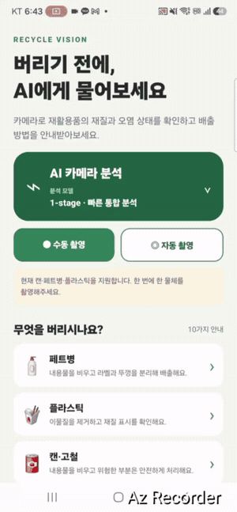
</p>

원본 영상: [앱 시연 영상](docs/assets/app_demo.mp4)

앱에서는 1-stage와 2-stage 모델을 전환할 수 있으며, 수동·자동 촬영 후 탐지 bbox, 재질, 오염 상태, confidence와 분리배출 안내를 확인할 수 있습니다.


### 데이터 변환 기준

원본 데이터는 AI Hub의 [재활용품 분류 및 선별 데이터](https://www.aihub.or.kr/aihubdata/data/view.do?dataSetSn=71362)를 사용했습니다.

원본 어노테이션의 재질, 오염 상태, 객체 좌표 정보를 다음과 같이 프로젝트 분류 체계로 변환했습니다.

- 재질: `can`, `pet`, `plastic`
- 오염 상태: `clean`, `outer`, `inner`
- 1-stage: 재질과 오염 상태를 조합한 9개 클래스
- 2-stage: YOLO가 3개 재질을 탐지하고, ResNet18이 crop 이미지의 오염 상태를 분류
- 객체 좌표: 원본 어노테이션의 객체 영역을 YOLO 형식의 정규화된 bbox로 변환

구체적인 변환 코드는
[`01_prepare_raw_dataset.ipynb`](notebooks/01_prepare_raw_dataset.ipynb)와
[`02_build_yolo_datasets.ipynb`](notebooks/02_build_yolo_datasets.ipynb)에서 확인할 수 있습니다.

## 문제 정의

최종 클래스는 재질 3종과 오염 상태 3종을 조합한 9개입니다.

| 재질 | 오염 없음 | 외부 오염 | 내부 오염 |
|---|---|---|---|
| Can | `can_clean` | `can_outer` | `can_inner` |
| PET | `pet_clean` | `pet_outer` | `pet_inner` |
| Plastic | `plastic_clean` | `plastic_outer` | `plastic_inner` |

오염도는 AI Hub 원천 annotation에서 활용 가능한 위치 정보를 기준으로 `clean`, `outer`, `inner`로 재구성했습니다. 이는 오염의 심각도나 실제 세척 필요 여부를 직접 나타내는 라벨은 아닙니다.

초기 약 1,000장의 탐색 실험에서 재질과 오염도를 결합할수록 세부 클래스 간 구분이 어려워지는 현상을 관찰했습니다. 초기 실험 로그는 최종 정량 비교에 포함하지 않고, 같은 수정 데이터로 다음 두 구조를 다시 학습·검증했습니다.

## 모델 구조

### 1-stage

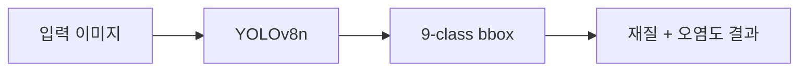

YOLOv8n 하나가 객체 위치와 최종 9-class를 동시에 예측합니다. 구조가 단순하고 중간 crop 과정이 없다는 장점이 있습니다.

### 2-stage

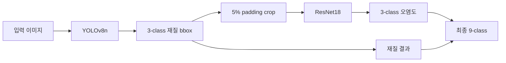

YOLOv8n이 먼저 재질과 bbox를 예측하고, bbox에 5% padding을 적용한 crop을 ResNet18이 `clean·outer·inner`로 분류합니다. 개별 문제는 단순해지지만 탐지 오류와 crop 변화가 분류 단계로 전달될 수 있습니다.

## 데이터

- 출처: AI Hub 재활용품 분류·선별 데이터
- 학습 데이터: 약 15,000장
- Validation: 3,158장 / 3,158개 객체
- 현재 validation 구성: 이미지당 객체 1개
- 입력 크기: YOLO 640, ResNet18 crop 224

<p align="center">
  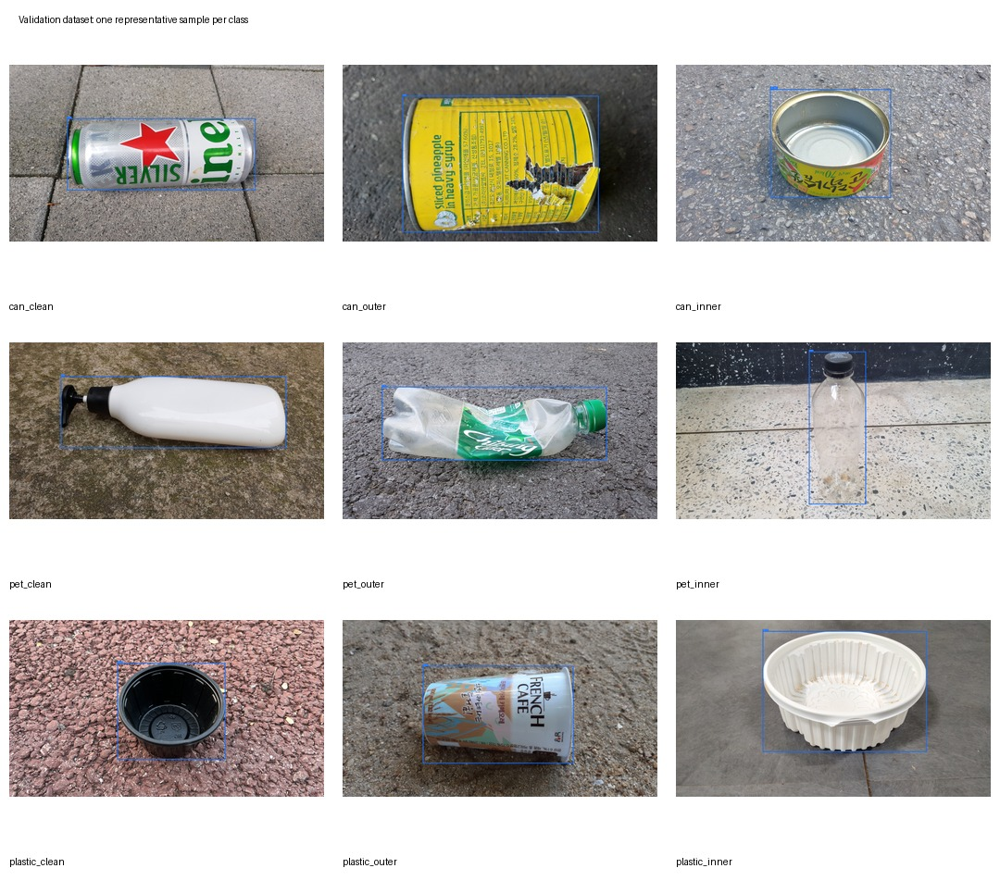
</p>

표본을 확인하면 원천 validation은 야외 바닥에 놓인 단일 객체가 많습니다. 반면 외부 테스트에는 손 가림, 세워진 객체, 생활 배경, 어두운 조명과 다중 객체가 포함됩니다. 이 촬영 조건 차이를 별도의 외부 테스트로 검증했습니다.

> 데이터 변환 과정에서 bbox 좌표 형식 오류를 발견해 변환 로직과 전체 라벨을 수정·재검증한 후 모든 최종 모델을 다시 학습했습니다. 잘못된 bbox로 학습한 결과는 최종 성능 비교에서 제외했습니다.

## 학습 결과

### YOLO detector

| 모델 | 예측 대상 | Precision | Recall | mAP50 | mAP50-95 |
|---|---|---:|---:|---:|---:|
| 1-stage YOLOv8n | 재질+오염도 9-class | 73.2% | 76.1% | 79.0% | 78.1% |
| 2-stage YOLOv8n | 재질 3-class | 94.6% | 94.7% | 98.0% | 97.0% |

두 detector는 예측 대상이 다르므로 위 수치는 최종 파이프라인의 직접적인 우열 비교가 아닙니다. 2-stage detector 결과는 문제를 재질 3-class로 단순화했을 때의 학습환경 성능을 보여줍니다.

<p align="center">
  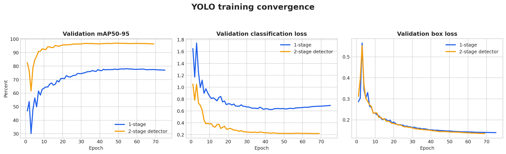
</p>

<p align="center">
  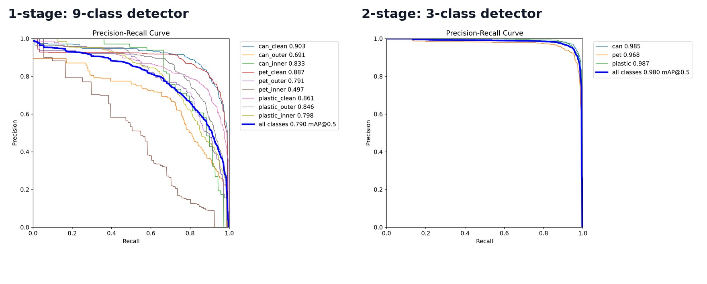
</p>

1-stage에서는 `pet_inner`의 AP50이 49.7%로 가장 낮았습니다. 내부 오염 클래스의 적은 표본, 단일 RGB 이미지에서 내부 오염을 판별하기 어려운 점, 세부 클래스 간 시각적 유사성이 영향을 준 것으로 판단했습니다.

### ResNet18 오염도 분류기

| 지표 | 결과 |
|---|---:|
| Best epoch | 36 |
| Validation accuracy | 81.7% |
| Macro F1 | 79.2% |
| Clean F1 | 85.4% |
| Outer F1 | 79.2% |
| Inner F1 | 73.0% |

<p align="center">
  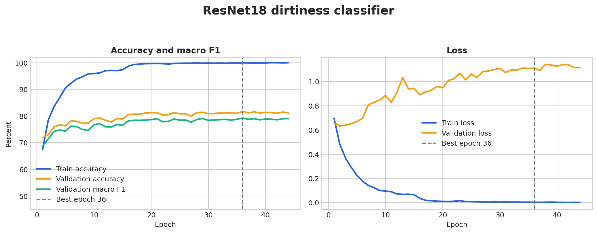
</p>

<p align="center">
  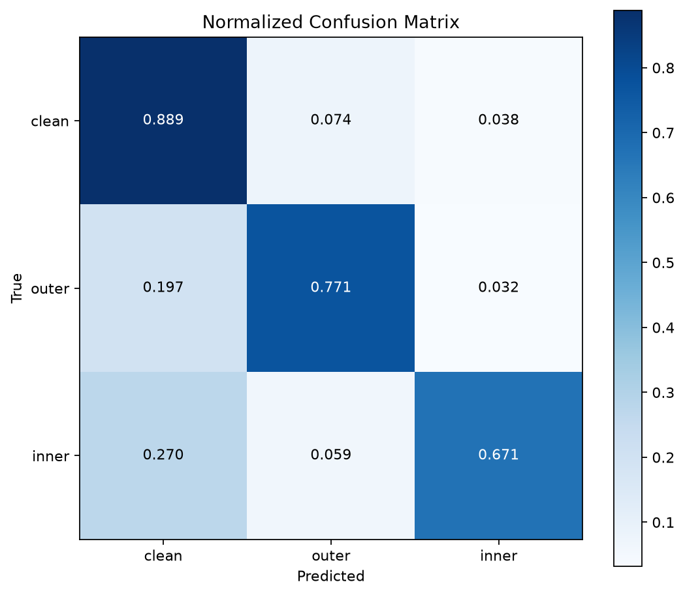
</p>

`outer`의 19.7%, `inner`의 27.0%가 `clean`으로 분류됐습니다. 특히 표본이 적은 inner의 recall이 67.1%로 가장 낮았으며, 학습 후반 train·validation 성능 차이도 확인됐습니다.

## 동일 출처 End-to-End 비교

동일한 validation 3,158장에 대해 두 파이프라인의 최종 9-class 결과를 다시 평가했습니다. 기준은 `confidence=0.50`, `IoU=0.50`입니다.

| 지표 | 1-stage | 2-stage |
|---|---:|---:|
| Localization recall | 97.9% | **99.8%** |
| 미검출률 | 2.1% | **0.2%** |
| 최종 9-class accuracy | 77.4% | **77.5%** |
| 최종 9-class macro F1 | 72.7% | **73.1%** |
| 검출 성공 시 9-class accuracy | **79.0%** | 77.7% |
| 검출 성공 시 재질 accuracy | **95.4%** | 94.8% |
| 검출 성공 시 오염도 accuracy | **81.8%** | 81.3% |
| Mean matched IoU | 98.0% | **98.1%** |
| 전체 처리시간 | **178.2 ms/image** | 259.4 ms/image |

두 구조의 최종 정확도 차이는 매우 작았습니다. 2-stage는 재질 탐지 성능이 높았지만 분류 단계를 추가한 최종 결과에서는 1-stage를 뚜렷하게 앞서지 못했고, 처리시간은 더 길었습니다.

<details>
<summary>동일 출처 validation 실패 사례 보기</summary>

### 1-stage

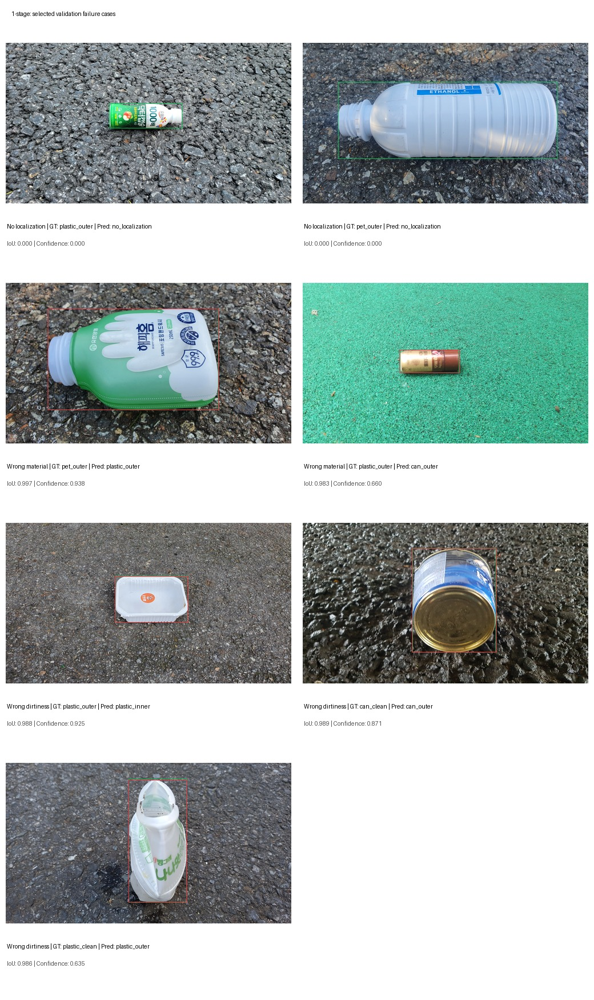

### 2-stage

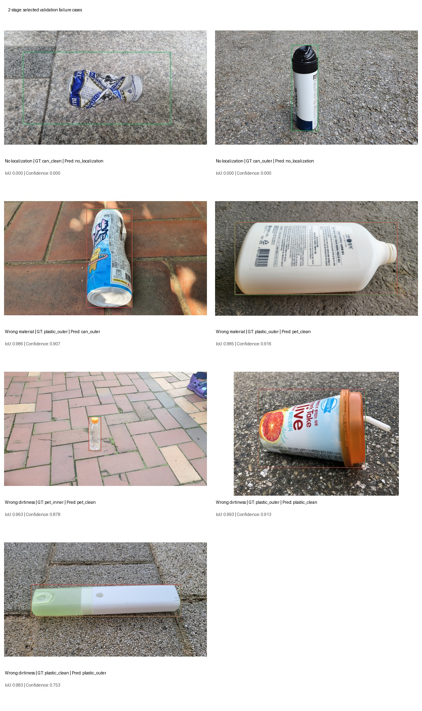

</details>

## 외부 실사용 환경 테스트

동일 출처 validation만으로 실제 사용 가능성을 판단하지 않기 위해 직접 촬영·라벨링한 외부 테스트셋을 구성했습니다.
해당 평가는 외부 환경에서의 취약점 확인용 평가 입니다.

- 이미지: 67장
- GT 객체: 78개
- 단일 객체: 60장
- 다중 객체: 7장
- 조건: simple, clutter, hand, dark, multi
- Dark 15장은 동일 객체의 조도 변환 이미지이며 독립 표본으로 해석하지 않음
- 평가 기준: `confidence=0.50`, `IoU=0.50`

### 동일 출처와 외부 테스트 비교

<p align="center">
  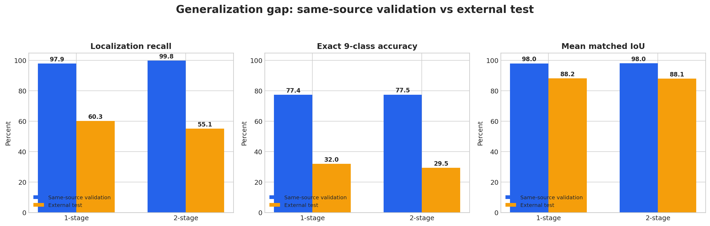
</p>

| 지표 | 1-stage validation | 1-stage 외부 | 2-stage validation | 2-stage 외부 |
|---|---:|---:|---:|---:|
| Localization recall | 97.9% | 60.3% | 99.8% | 55.1% |
| 최종 9-class accuracy | 77.4% | 32.1% | 77.5% | 29.5% |
| 검출 성공 시 9-class accuracy | 79.0% | 53.2% | 77.7% | 53.5% |
| Mean matched IoU | 98.0% | 88.2% | 98.0% | 88.1% |

외부 환경에서는 두 모델 모두 큰 폭의 성능 저하를 보였습니다. bbox를 찾았을 때의 위치 품질뿐 아니라 객체 자체를 놓치는 비율과 검출 후 클래스 오분류가 함께 증가했습니다.

### 조건별 결과

<p align="center">
  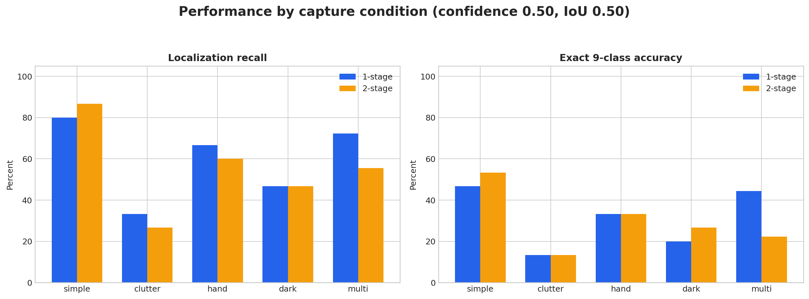
</p>

단순 배경보다 clutter와 dark 조건에서 localization recall이 낮았고, 학습에 포함되지 않은 다중 객체에서는 겹친 객체를 하나로 합치거나 일부 객체를 누락하는 현상이 발생했습니다.

### 2-stage Oracle 분석

<p align="center">
  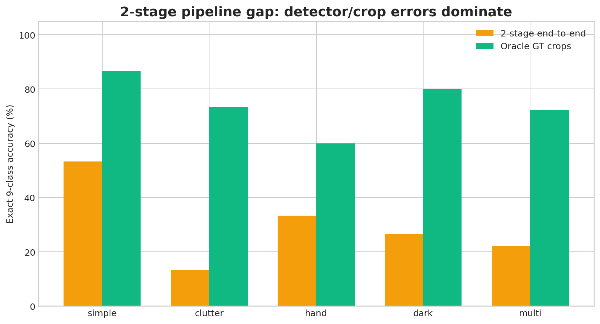
</p>

2-stage 분류기에 detector crop 대신 GT bbox crop을 제공한 Oracle 정확도는 74.4%였습니다. 실제 end-to-end 정확도 29.5%와의 차이는 다음 문제가 함께 작용했음을 보여줍니다.

- 객체 미검출
- 재질 오분류
- 예측 bbox와 학습에 사용한 GT crop 사이의 차이
- crop에 포함된 배경·손·다른 객체
- 실사용 객체와 학습 데이터 사이의 시각적 분포 차이

Oracle 결과만으로 특정 원인의 기여도를 확정할 수는 없지만, 2-stage 분류기 자체보다 detector와 crop 전달 과정에서 큰 성능 손실이 발생한다는 진단 근거로 사용했습니다.

### 대표 사례

<p align="center">
  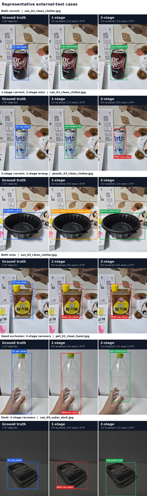
</p>

78개 객체 중 두 모델 모두 정답인 객체는 14개, 1-stage만 정답은 11개, 2-stage만 정답은 9개, 두 모델 모두 실패한 객체는 44개였습니다. 1-stage가 최종 정답 2개를 더 기록했지만 현재 표본만으로 구조의 확정적인 우열을 주장하기는 어렵습니다.

<details>
<summary>다중 객체 테스트 보기</summary>

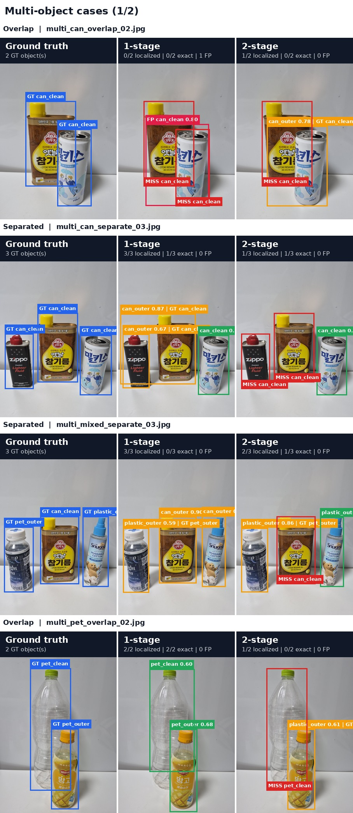

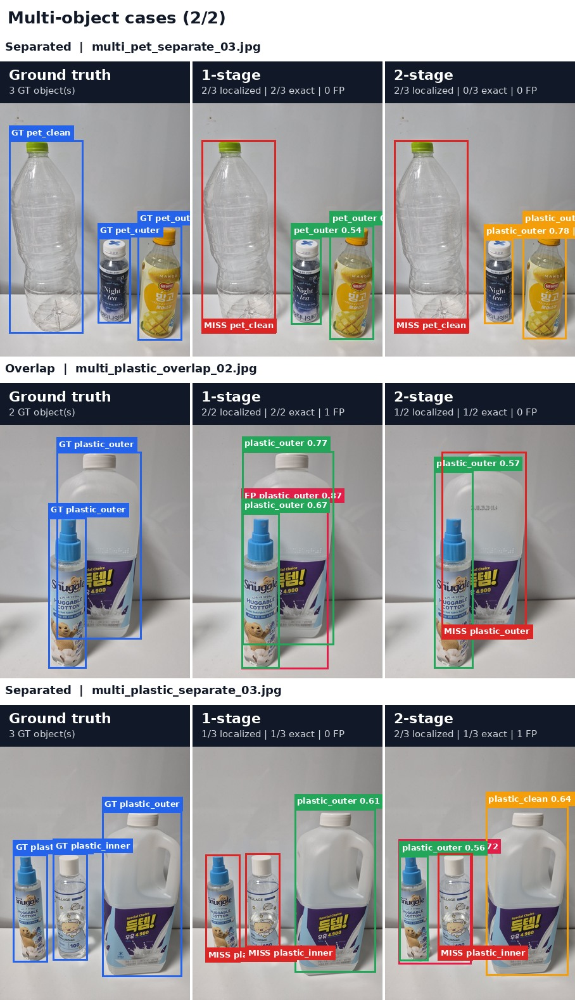

</details>

## 결과 분석

### 1. 학습 데이터와 사용 환경의 차이

학습·validation 데이터는 같은 원천 데이터에서 분리됐으며 단일 객체와 유사한 촬영 환경을 공유합니다. 외부 테스트에는 다음 변화가 포함됐습니다.

- 손에 들거나 일부가 가려진 객체
- 세워진 객체와 다양한 촬영 각도
- 단순 배경이 아닌 실내 생활환경
- 투명·반사 재질과 조도 변화
- 여러 객체의 분리 및 겹침
- 학습에서 보지 못한 제품 형태

따라서 동일 출처 validation은 학습 파이프라인이 해당 데이터 분포를 학습했는지를 보여주며, 외부 테스트는 새로운 촬영 환경에 대한 일반화 한계를 보여줍니다.

### 2. 라벨 정의와 실제 목표의 차이

원천 데이터의 오염도는 오염의 심각도가 아닌 위치를 기준으로 합니다. 일부 내부·외부 오염은 단일 RGB 사진에서 명확하게 구분하기 어렵고, 실제 분리배출에서 중요한 세척 필요 여부와도 완전히 일치하지 않습니다.

또한 투명 음료병과 기타 플라스틱 용기처럼 외형만으로 PET 여부를 확정하기 어려운 객체가 존재합니다. 실제 서비스에서는 재질 표시 확인, 제품 정보 또는 사용자 보조 입력이 필요할 수 있습니다.

### 3. 1-stage와 2-stage

- 1-stage는 중간 전달 과정이 없고 더 빠르지만 9개 세부 클래스를 동시에 학습해야 합니다.
- 2-stage는 재질 탐지와 오염도 분류를 분리하지만 탐지·crop 오류가 다음 단계로 전파됩니다.
- 문제를 단계별로 단순화하면 개별 모델의 성능은 높아질 수 있지만 최종 end-to-end 성능 향상을 보장하지는 않았습니다.
- 현재 외부 테스트에서는 두 모델 모두 실사용에 충분한 성능을 확보하지 못했습니다.

## 프로젝트의 한계

- 원천 데이터와 모바일 촬영 환경 사이의 domain gap
- 학습 데이터가 이미지당 단일 객체 중심
- inner 클래스의 적은 표본과 클래스 불균형
- 오염 위치와 실제 세척 필요 여부 사이의 의미 차이
- PET와 일반 플라스틱의 시각적 모호성
- 작은 외부 테스트셋으로 인한 통계적 불확실성
- Dark 이미지가 독립 촬영본이 아닌 파생 데이터
- 2-stage에서 detector·crop·classifier 오류가 누적됨
- 현재 모델은 자유 촬영 환경의 완전 자동 분류에 사용하기 어려움

## 적용 방향 및 개선 계획

현재 결과를 기준으로 완전 자동 분류보다 통제된 촬영 환경의 작업자 보조 시스템이 현실적인 적용 방향입니다.

- 실제 앱 촬영 조건과 유사한 데이터 추가 수집
- 손 가림, 다중 객체, 세로 배치, 실내 배경 augmentation
- 다중 객체가 포함된 탐지 데이터로 재학습
- 오염도를 위치가 아닌 세척 필요 여부 중심으로 재정의
- ambiguous 재질을 별도 표기하거나 사용자 확인 단계 추가
- 작은 객체 대응을 위한 해상도·augmentation·모델 크기 실험
- 2-stage 예측 crop과 GT crop을 비교하는 crop quality audit
- 작업자 보조 목적에 맞춰 recall 중심 threshold 재조정

## 기술 스택

| 영역 | 기술 |
|---|---|
| Detection | YOLOv8n, Ultralytics |
| Classification | ResNet18, PyTorch, torchvision |
| Backend | FastAPI, Uvicorn |
| Mobile | React Native, Expo, TypeScript |
| Data/Analysis | Python, Pandas, NumPy, Matplotlib |
| Annotation | YOLO bbox format |
| Version control | Git, GitHub, Git LFS |

## 프로젝트 구조

```text
recycleApp/
├── backend/
│   ├── app/
│   │   ├── main.py
│   │   ├── schemas.py
│   │   └── services/
│   │       ├── one_stage.py
│   │       └── two_stage.py
│   ├── tests/
│   └── requirements.txt
├── frontend/
│   ├── App.tsx
│   ├── src/
│   └── assets/
├── docs/
│   └── assets/
└── README.md
```

## 실행 방법

### Backend

```powershell
cd backend
python -m venv venv
.\venv\Scripts\Activate.ps1
pip install -r requirements.txt
python -m uvicorn app.main:app --host 0.0.0.0 --port 8000
```

모델 weight 경로와 앱의 API 주소는 실행 환경에 맞게 설정해야 합니다.

### Frontend

```bash
cd frontend
npm install
npx expo start
```

모바일 기기와 서버 PC는 서로 접근 가능한 네트워크에 연결되어야 합니다.

## 프로젝트를 통해 확인한 점

동일 출처 validation에서 높은 지표를 얻는 것과 실제 사용 환경에서 안정적으로 동작하는 것은 다른 문제였습니다. 모델을 서버와 앱에 연결하고 외부 데이터를 직접 수집해 평가하면서 데이터 분포, 라벨 정의, 다중 객체, threshold와 파이프라인 오류 전파가 최종 성능에 미치는 영향을 확인했습니다.

이 프로젝트는 높은 validation 수치 제시에 그치지 않고, 실제 사용 과정에서 발생한 실패를 정량화하고 다음 개선 방향을 도출하는 데 목적을 둡니다.

---

### English Summary

This project compares a single YOLOv8 9-class detector with a two-stage pipeline consisting of a 3-class YOLOv8 material detector and a ResNet18 dirtiness classifier. Both pipelines achieved similar end-to-end accuracy on same-source validation data, but performance dropped substantially on a manually collected external test set containing hand occlusion, clutter, illumination changes, and multiple objects. The project includes a FastAPI inference server, an Expo mobile application, condition-wise evaluation, and an Oracle crop experiment used to identify detector-to-classifier error propagation.
